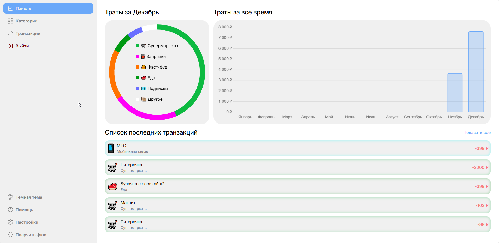
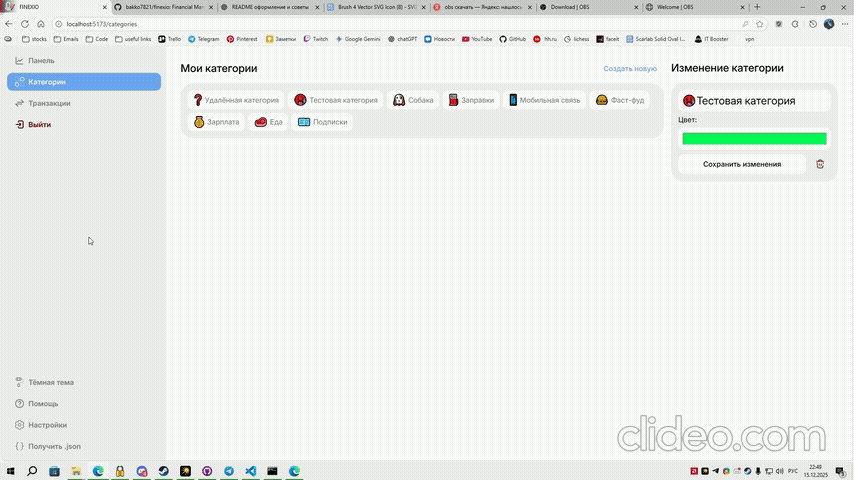

# Finexio 💸


---

## 📊 О проекте

**Finexio** — это fullstack‑приложение для учета личных финансов и анализа расходов.
Проект позволяет записывать транзакции, распределять их по категориям и наглядно отслеживать траты с помощью интерактивных графиков.

Проект создавался как **pet‑project для портфолио Junior frontend / fullstack разработчика**.

🎥 **Полный функционал:** https://youtu.be/C-zXnkUiVPo

---

## ✨ Основные возможности

### 🔐 Аутентификация

* Регистрация и авторизация пользователей
* Хэширование паролей с помощью **bcrypt**
* Авторизация через **JWT (JSON Web Token)**

.gif>)
---

### 🗂️ Категории расходов

* Создание категорий (например: `🛒 Супермаркеты`, `🚗 Машина`)
* Редактирование категорий
* Удаление категорий

 (1).gif>)
 (4).gif>)
---

### 💳 Транзакции

* Создание транзакций с указанием категории
* Редактирование транзакций
* Удаление транзакций

Пример:

```
Вкусно и точка  -1200 ₽
```

 (2).gif>)
 (3).gif>)

---

### 📈 Аналитика и графики

* Анализ расходов за текущий месяц
* Группировка трат по категориям
* Bar‑график с количеством расходов по месяцам

Графики реализованы с помощью **Chart.js**.



* диаграмма расходов по категориям
* bar‑график трат по месяцам

---

### 🌗 Темная и светлая тема

* Переключение между светлой и темной темой
* Сохранение выбранной темы



---

## 🧱 Стек технологий

### Frontend

* **Vite** (React + TypeScript)
* **Redux Toolkit**
* **Sass**
* **Chart.js**
* **Axios**
* Кастомные React‑хуки

### Backend

* **TypeScript**
* **Node.js + Express.js**
* **PostgreSQL**
* **JWT**
* **bcrypt**
* **dotenv**
* **cors**
* **nodemon**

---

## 🚀 Запуск проекта локально

### 1. Клонирование репозитория

```bash
git clone https://github.com/bakko7821/finexio.git
```

### 2. Установка зависимостей

Frontend:

```bash
cd client
npm install
```

Backend:

```bash
cd server
npm install
```

### 3. Переменные окружения

Создайте `.env` файл в папке `server`:

```env
PORT=5000
DB_HOST=localhost
DB_PORT=5432
DB_NAME=finexio
DB_USER=postgres
DB_PASSWORD=your_password
JWT_SECRET=your_secret_key
```

### 4. Запуск

Backend:

```bash
npm run dev
```

Frontend:

```bash
npm run dev
```

---

## 🎯 Цели проекта

* Закрепить навыки **React + TypeScript**
* Практика **Redux Toolkit** и работы с глобальным состоянием
* Работа с REST API и JWT‑авторизацией
* Визуализация данных с помощью графиков
* Создание полноценного fullstack‑приложения

---

## 👨‍💻 Автор

Проект разработан в рамках pet‑project для портфолио.

Если есть идеи, фидбек или предложения — буду рад ⭐
